verein.cloud APIs
================

# VV API

This project contains the implementation of the verein.cloud API, which connects club administration software (S-Verein) to the verein.cloud app.
The API uses Keycloak JWT tokens for authorization.

## API Reference
Please find the details of the API in our swagger hub:
https://app.swaggerhub.com/apis/Comciencia/verein.cloud.VV/

The source yaml file for Swagger is also part of this project (swagger folder).

## Testing
Currently, a test implementation of the API runs on https://vcloud.dev.comciencia.cl.

Also, there is a keycloak.paw file in the swagger folder that can be used with the Mac application Paw (similar to Postman) to test the API.

## Platform
The API is implemented with the Laravel spin-off "Lumen".

## Docker container
The project also contains docker containers that include the necessary Apache/PHP environment and can be used to develop or deploy this functionality (see servers folder). To install this container, clone this GIT repository on your server or local machine, then cd into servers and follow these steps:

* Adapt .env settings to your needs, especially the paths PROJECT_ROOT and VV_LINK (points to VV installation)
* Run build.sh

------------------

# CRM API
In addition to the API for access to the club administration data, there is a second API that gives access to the management part
formerly implemented by the CAdmin application.  Through this interface, a CRM application can create, modify and deactivate or 
delete clubs.

## Authentication
This API uses the client credentials flow for user authentication, which means that every client that wishes to connect to it, requires a set of client credentials (id and secret). This means, that in Keycloak a client has to be created for each consumer of the API. This is done as described below (based on https://fullstackdeveloper.guru/2022/03/16/how-to-set-up-keycloak-for-oauth2-client-credentials-flow/).

1) Go to Client on the left pane and create a new client:

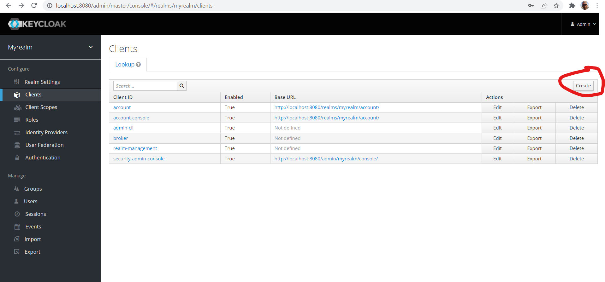

2) Add the client (instead if myclient, please name it "client-credentials-crm"):

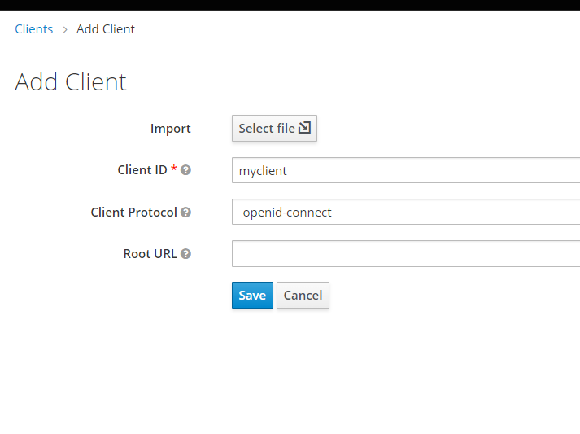

3) Once you create the client you will be shown a lot of configuration options.
To set this client for “client credentials” flow in OAuth2, do the below three configurations:
  * Set access type as “confidential”
  * Switch ON “Service Accounts Enabled”
  * Switch OFF other modes (Standard Flow enabled ,Direct Access Grants Enabled etc)
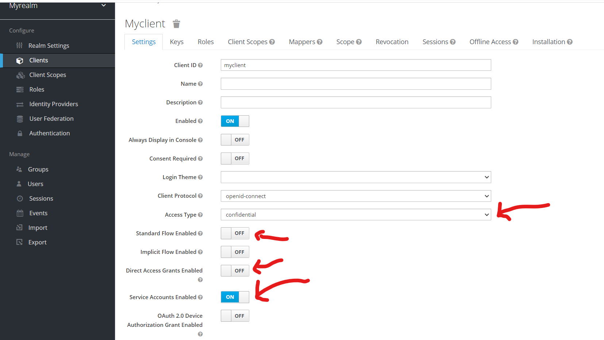

4) Click on “save”.

5) Once you do this, your client secret is automatically generated:
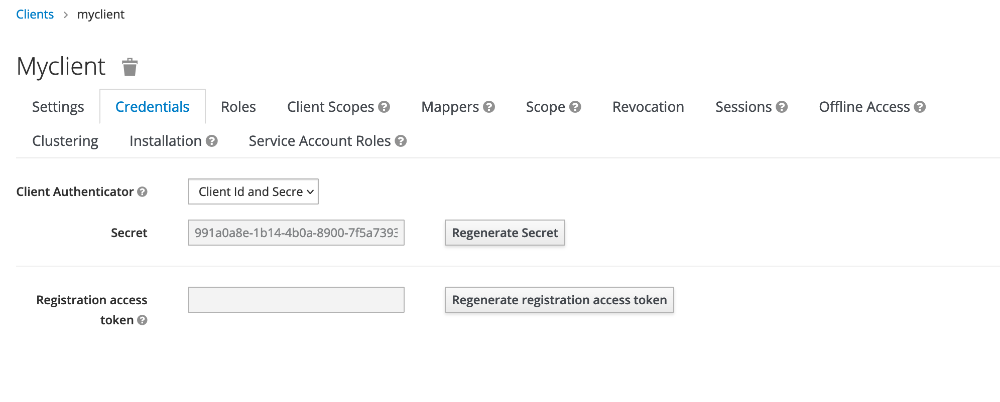

6) You need to use this secret and your client id (“client-credentials-crm” in the above case) to generate access tokens which will be used to access the OAuth2 protected “resource servers”.  

7) Create a role: Do this by selecting - still within the client context - the option "Roles" in the menu above, then fill-in the name "crm-access" and a description and save.
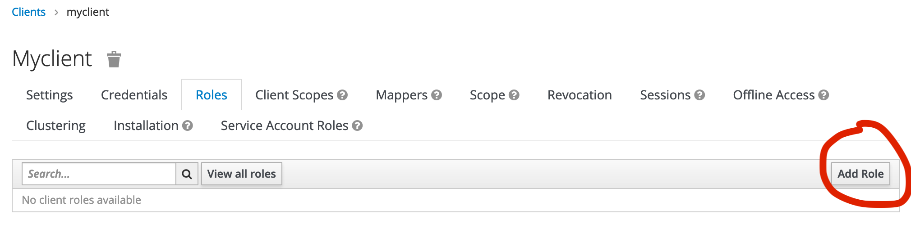
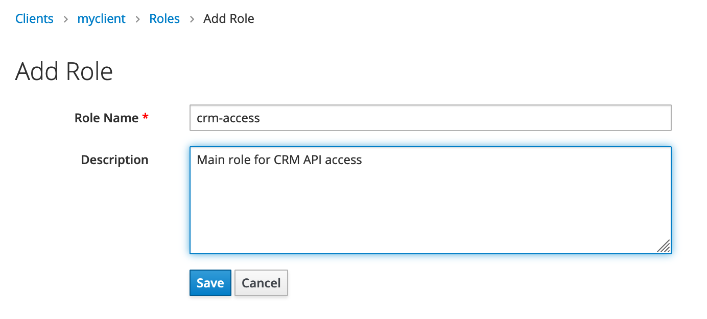

8) Now add a mapper for this client by returning to the client context (click the client name in the breadcrumbs), then select the "Mappers" tab and click the "Add Builtin" button.
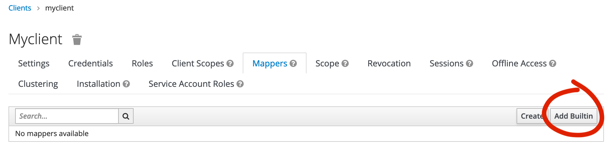

9) Find the option "client roles" in the list and select the corresponding checkbox:
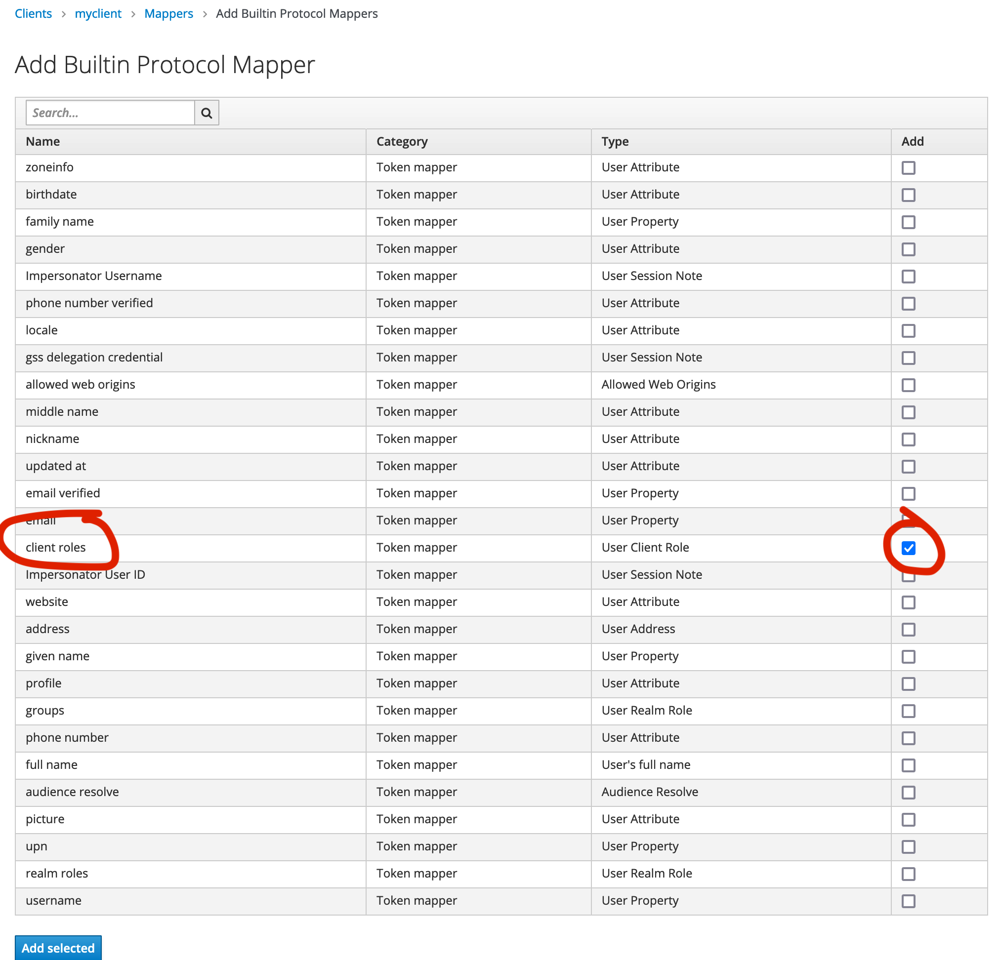
Click the "Add selected" button at the bottom.

10) Add a service account role by editing the client and then selecting the tab "Service Account Roles". Select your client in "Client Roles" and then assign your role as shown below.
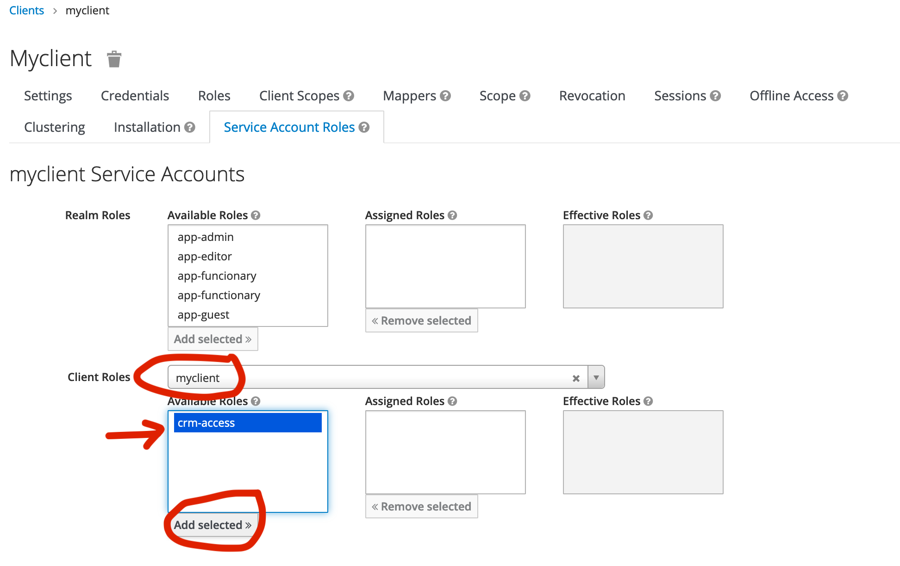

11) Make sure the new client has the Client Scopes "email" and "profile" assigned.
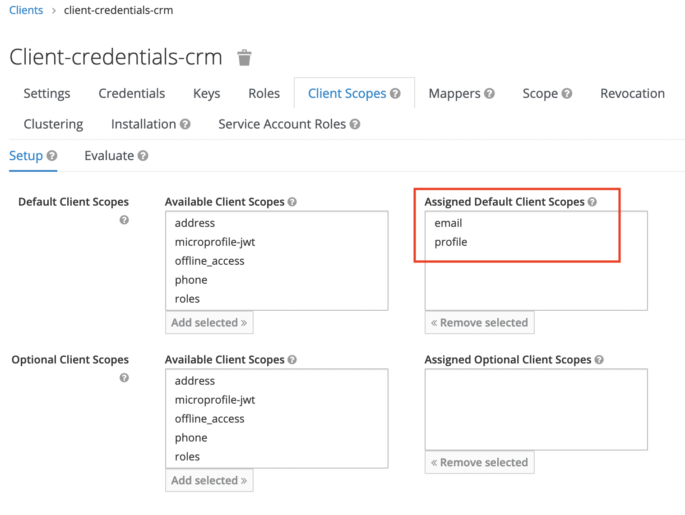

The Keycloak set up is now complete.

Now, the client needs to obtain a token in order to be able to access the API.  Here is an example of how to do this with curl:

```bash
curl -X "POST" "http://keycloak.app.verein.cloud/auth/realms/demo/protocol/openid-connect/token" \
     -H 'Content-Type: application/x-www-form-urlencoded' \
     --data-urlencode "grant_type=client_credentials" \
     --data-urlencode "client_id=my-crm-client" \
     --data-urlencode "client_secret=65053245-34e0-420b-a31f-4511714f20d8"
```

The token may look something like this:
```
eyJhbGciOiJSUzI1NiIsInR5cCIgOiAiSldUIiwia2lkIiA6ICI4ZlM5M2xEWGhQSmQ4emFWV1A0bkJUUlBjXzNEZkF3Ry1SOXM5ZVppY0xvIn0.eyJleHAiOjE2NTI5MDg1MDEsImlhdCI6MTY1MjgyMjEwMSwianRpIjoiZTQyYzc2ZWMtOTdiMC00NDQ5LTkzMjgtNWE3Zjg4OTU5YzA2IiwiaXNzIjoiaHR0cDovL2tleWNsb2FrLmFwcC52ZXJlaW4uY2xvdWQvYXV0aC9yZWFsbXMvZGVtbyIsInN1YiI6IjAwNDkwODZjLTA0YjUtNGVhMy1iNzc4LWE3NTA2M2M2Njc4MyIsInR5cCI6IkJlYXJlciIsImF6cCI6Im15Y2xpZW50IiwiYWNyIjoiMSIsInJlc291cmNlX2FjY2VzcyI6eyJteWNsaWVudCI6eyJyb2xlcyI6WyJjcm0tYWNjZXNzIl19fSwic2NvcGUiOiJwcm9maWxlIGVtYWlsIiwiY2xpZW50SG9zdCI6IjEyNy4wLjAuMSIsImNsaWVudElkIjoibXljbGllbnQiLCJlbWFpbF92ZXJpZmllZCI6ZmFsc2UsInByZWZlcnJlZF91c2VybmFtZSI6InNlcnZpY2UtYWNjb3VudC1teWNsaWVudCIsImNsaWVudEFkZHJlc3MiOiIxMjcuMC4wLjEifQ.H3LqzUexLlPyJDF1FqsD07JlwWr4jI5xmOFUhChowqJM3Fg8lGG53ifS7YbeweFB0GP-BEga3lM7FHw4EQQW1q0eoSlHNF8jI_FSFTKRCfR4WtzAm3PFfFG38_p58PDNgm7QYZ-StN6_D9T4itASIh-r6DDaEr0JdQvwCZNkwdrs8_VZ8RL5yuu3W4OH9DZbQZvKK55YVyEDGrmqjTLTLLsAJPS9tyg73raZYSW9aIYgfKE_5TlDnZt0F0oayhT6aYc2hcgrirHWCZofMiVFuM1QSUiNakzyZlhIJ-WSWjBJ3bWoweY8fNjdYs2LtEAPXXfBtqs4bCl9oT0EGjXhVg
```
If you paste it into https://jwt.io, the decoded token looks like this:

```json
{
  "exp": 1652908501,
  "iat": 1652822101,
  "jti": "e42c76ec-97b0-4449-9328-5a7f88959c06",
  "iss": "http://keycloak.app.verein.cloud/auth/realms/demo",
  "sub": "0049086c-04b5-4ea3-b778-a75063c66783",
  "typ": "Bearer",
  "azp": "myclient",
  "acr": "1",
  "resource_access": {
    "myclient": {
      "roles": [
        "crm-access"
      ]
    }
  },
  "scope": "profile email",
  "clientHost": "127.0.0.1",
  "clientId": "myclient",
  "email_verified": false,
  "preferred_username": "service-account-myclient",
  "clientAddress": "127.0.0.1"
}
```

Now, the client needs to be added to the .env file of the Lumen installation.  There is a parameter called 
KEYCLOAK_CLIENTS_CONFIG that is in JSON format and contains all the Keycloak client information. It is in one single line, but reformatted looks like this:

```json
{
  "verein-nodejs": {
    "load_user_from_database": false,
    "user_provider_credential": false,
    "token_principal_attribute": "attributes",
    "append_decoded_token": false,
    "allowed_resources": "verein-nodejs"
  },
  "client-credentials-crm": {
    "load_user_from_database": false,
    "user_provider_credential": "service-account-myclient",
    "token_principal_attribute": "preferred_username",
    "append_decoded_token": false,
    "allowed_resources": "myclient"
  }
}
```

The first block, "verein-nodejs", is for normal API operations as used by the app.

The second block, here "myclient", is where the new client is configured. Add a new block for each client and give it the name of that client.
Set "user_provider_credential" to the content of the preferred_username filed in the JWT token, in the example "service-account-myclient".
Then set "token_principal_attribute" to "preferred_username" and "allowed_resources" to the client name, in this case "myclient".

Finally, reformat the JSON to a single line and add it to the .env file, right after KEYCLOAK_REALM_PUBLIC_KEY:
```
KEYCLOAK_CLIENTS_CONFIG={"verein-nodejs":{"load_user_from_database":false,"user_provider_credential":false,"token_principal_attribute":"attributes","append_decoded_token":false,"allowed_resources":"verein-nodejs"},"client-credentials-crm":{"load_user_from_database":false,"user_provider_credential":"service-account-client-credentials-crm","token_principal_attribute":"preferred_username","append_decoded_token":false,"allowed_resources":"client-credentials-crm"}}
```

Now the client should be ready to function with the CRM API.

## API Reference
Find the API reference on SwaggerHub:
https://app.swaggerhub.com/apis/Comciencia/verein.cloud.CRM/

------------------

# BB API

This API connects the financial software BuchhaltungsButler with S-Verein.

## Keycloak configuration
To use this API, the following configurations are necessary in Keycloak.

### Additional client
- Create an additional client called "bbutler-api-client", with role "bbutler-access", following the same steps described above for the CRM API.
- During or after creation, configure a base URL for this client, such as https://keycloak.staging.verein.cloud/auth/realms/demo/account/.
- Also enable "Standard Flow" and configure the "Valid Redirect URIs" (this should be given by the BB folks).
- Go to the "Mappers" tab and add the following mappers, so that the custom attributes will be added to the JWT (all with category "Token mapper" and type "User Attribute"):
  - users_id, claim JSON type = String
  - customers_id, claim JSON type = String
  - company_name, claim JSON type = String
  - phone, claim JSON type = String
  - role, claim JSON type = String
  - vid, claim JSON type = String
- The auth URL will then look something like this: \
https://keycloak.staging.verein.cloud/auth/realms/demo/protocol/openid-connect/auth?client_id=bbutler-api-client&redirect_uri=https%3A%2F%2Fmy-url.com%2Fredirect%2Fsomething%2F&state=eaf27ba4-6c7b-4d6c-8237-9649b3e778e9&response_type=code&login_hint=demoverein

### Additional user
Create an additional user called "spi-api-user" with no special configurations. This user will be used by the User SPI to generate tokens for the communication with the special BB API.

### Theme
Install the custom theme "tineon" for Keycloak. Enable it by going to "Realm Settings > Themes" and selecting "tineon" in "Login Theme".
Also enable Internationalization on the same screen and set the default locale to "de".

### Authentication SPI
Install the Authentication SPI "vvapi-username-password-form" in Keycloak.

- In the "Authentication" menu of Keycloak, under "Flows", select "Browser" and click "Copy".
- Name the copy "VV Browser" and remove the Auth types "Kerberos" and "Identity Provider Redirector".
- Click "Actions > Edit flow" for "Forms" and change the name tp "VV Browser forms". Then set this type to "required".
- Click "Actions > Add execution" and select the Provider "VV API Username Password Form". Then set this execution to "required".
- Remove all other executions under "VV Browser forms".
- Go to "Authentication > Bindings" and change "Browser flow" to the newly created "VV Browser".

### User Storage SPI 
Install the User Storage SPI "vvapi-user-provider" in Keycloak. This will make a provider of the same name appear in Keycloak's User Federation menu. This provider must be enabled and configured.

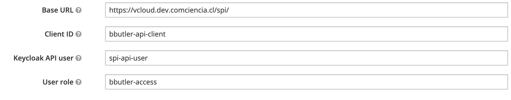

**Important:** Set the Cache Policy in Cache Settings to "NO_CACHE", because otherwise the attributes are not added to the federated users.

### API environment
The new client now needs to be added to the .env file for the API in the same way as for the CRM API.
